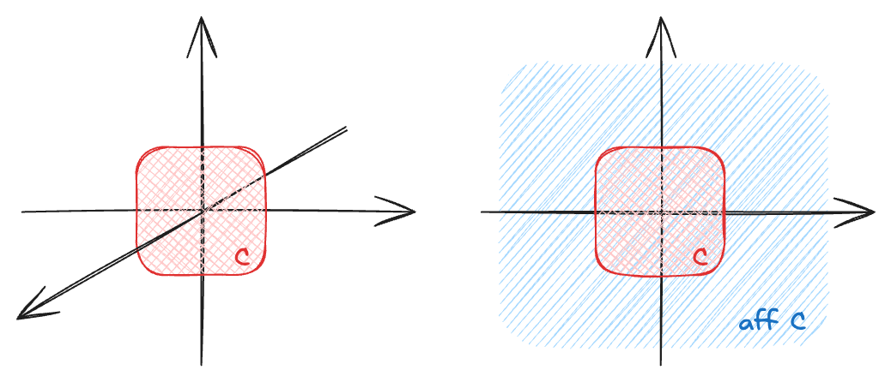
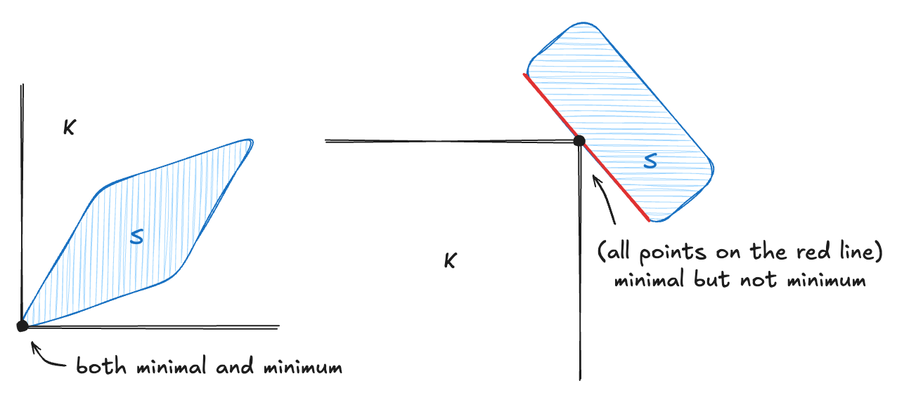
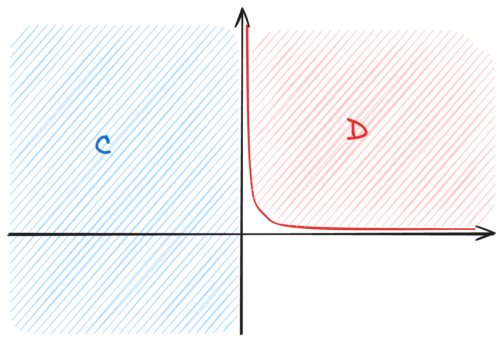

# :book: Convex sets

**Table of Contents**
- [:book: Convex sets](#book-convex-sets)
  - [Convex sets](#convex-sets)
    - [Affine sets](#affine-sets)
    - [Relative interior](#relative-interior)
    - [Convex sets](#convex-sets-1)
    - [Cones](#cones)
    - [Hyperplane and halfspaces](#hyperplane-and-halfspaces)
    - [Euclidean balls and ellipsoids](#euclidean-balls-and-ellipsoids)
    - [Polyhedra](#polyhedra)
    - [The positive semidefinite cone](#the-positive-semidefinite-cone)
  - [Operations preserving convexity](#operations-preserving-convexity)
    - [Intersection](#intersection)
    - [Affine functions](#affine-functions)
    - [Perspective functions](#perspective-functions)
    - [Linear-fractional](#linear-fractional)
  - [Generalized inequalities](#generalized-inequalities)
    - [Proper cones and generalized inequalities](#proper-cones-and-generalized-inequalities)
    - [Minimum and minimal elements](#minimum-and-minimal-elements)
  - [Separating and supporting hyperplanes](#separating-and-supporting-hyperplanes)
    - [Separating hyperplane Theorem](#separating-hyperplane-theorem)
    - [Supporting hyperplanes](#supporting-hyperplanes)
  - [Dual cones](#dual-cones)
    - [Dual generalized inequalities](#dual-generalized-inequalities)

## Convex sets

### Affine sets
Suppose $x_1\neq x_2$ are two points in $\mathbb{R}^n$,

$$
y=\theta x_1+(1-\theta)x_2
$$

is a line, and line segment if $0\leq\theta\leq1$.

A set $C\subseteq\mathbb{R}^n$ is affine if for any $x_1,x_2\in C$ and $\theta\in\mathbb{R}$,

$$
\theta x_1+(1-\theta)x_2\in C.
$$

Affine combination:

$$
x=\theta_1x_1+\dots+\theta_kx_k\ ;\ \ \theta_i\in\mathbb{R},\ \sum_{i=1}^k\theta_i=1.
$$

> Affine set contains every affine combination of its points.

- closed sets are not affine sets
- $\mathbb{R}^2$ is an affine set

> **Example 2.1** The solution set of a system of linear equations, i.e., $C=\\{x\mid Ax=b\\}$, is an affine set. Suppose $x_1,x_2\in C$, we have $Ax_1=b$ and $Ax_2=b$,
> 
> $$
> \begin{align*}
> A(\theta x_1+(1-\theta)x_2)&=\theta Ax_1+(1-\theta)Ax_2\\
> &=\theta b + (1-\theta)b\\
> &=b\in C.
> \end{align*}
> $$

Affine hull is the set of all affine combinations, denoted as $\mathbf{aff}\ C$:

$$
\mathbf{aff}\ C=\\{\theta_1x_1+\dots+\theta_kx_k\mid x_1,\dots,x_k\in C,\ \sum_{i=1}^k\theta_i=1\\}.
$$

> Affine hull is the smallest affine set that contains $C$.

### Relative interior
We often use the relative interior instead of the topology interior. Lets first look at an example.

> **Example 2.2** Consider a square in $(x_1,x_2)$-plane in $\mathbb{R}^3$
> 
> $$
> C=\\{x\in\mathbb{R}^3\mid -1\leq x_1\leq1,\ -1\leq x_2\leq1,\ x_3=0\\},
> $$
> 
> the interior of $C$ is empty.

This is weird because in common sense, the square should have a nonempty interior. This is because the $x_3$ coordinate is fixed, thereby the $x_3$ plane is redundant in such case. We define the relative interior of the set $C$, denoted $\mathbf{relint}\ C$, as its interior relative to $\mathbf{aff}\ C$.

> **Example 2.2** (continue) The affine hull of $C$ is $\\{x\in\mathbb{R}^3\mid x_3=0\\}$ and the relative interior
> 
> $$
> \mathbf{relint}\ C=\\{x\in\mathbb{R}^3\mid -1 < x_1 < 1,\ -1 < x_2 <1,\ x_3=0\\}
> $$
> 
> is now nonempty.

    
    
<b>Fig. 1 </b>Relative interior.

Using the relative interior allows us to ignore redundant dimensions.

### Convex sets
A set $C\subseteq\mathbb{R}^n$ is convex if for any $x_1,x_2\in C$ with $0\leq\theta\leq1$,

$$
\theta x_1+(1-\theta)x_2\in C.
$$

Convex combination:

$$
x=\theta_1x_1+\dots+\theta_kx_k\ ;\ \ 0\leq\theta_i\leq1,\ \sum_{i=1}^k\theta_i=1.
$$

> Convex set contains every convex combination of its points.

Convex hull is the set of all convex combinations, denoted as $\mathbf{conv}\ C$:

$$
\mathbf{conv}\ C=\\{\theta_1x_1+\dots+\theta_kx_k\mid x_1,\dots,x_k\in C,\ \sum_{i=1}^k\theta_i=1,\ \theta_i\geq0\\}.
$$

> Convex hull is the smallest convex set that contains $C$.

### Cones
A set $C$ is called a cone or nonnegative homogeneous if for every $x\in C$ and $\theta\geq0$,

$$
\theta x\in C.
$$

> A set $C$ is a convex cone if for any $x_1,x_2\in C$ and $\theta_1,\theta_2\geq0$,
> 
> $$ \theta_1x_1+\theta_2x_2\in C.$$

Conic combination: 

$$
x=\theta_1x_1+\dots+\theta_kx_k\ ;\ \ \theta_i\geq0.
$$

> Cone contains every conic combination of its points.

Conic hull:

$$
\\{\theta_1x_1+\dots+\theta_kx_k\mid x_i\in C,\ \theta_i\geq0,\ i=1,\dots,k\\}.
$$

> Conic hull is the smallest cone that contains $C$.

### Hyperplane and halfspaces
A hyperplane is a set of the form:

$$
\begin{align*}
\\{x\mid a^\top x=b\\},
\end{align*}\tag{2.1}
$$

where $a\in\mathbb{R}^n$, $a\neq0$, and $b\in\mathbb{R}$.

> Let $(n_x,n_y,n_z)^\top$ be the normal vector, with inner product,
> 
> $$
> n_x(x-x_0)+n_y(y-y_0)+n_z(z-z_0)=0\implies a^\top x=n_xx_0+n_yy_0+n_zz_0=b.
> $$

A hyperplane divides $\mathbb{R}^n$ into two halfspaces:

$$
\{x\mid a^\top x\geq b\}\ ;\ \ \\{x\mid a^\top x\leq b\\},\ a\in\mathbb{R}^n,\ a\neq0,\ b\in\mathbb{R}.
$$

### Euclidean balls and ellipsoids
A (Euclidean) ball in $\mathbb{R}^n$ has the form:

$$
B(x_c,r)=\\{x\mid\\|x-x_c\\|_2\leq r\\}=\\{x_c+ru\mid\\|u\\|_2\leq1\\},
$$

where $r>0$.

> Euclidean ball is a convex set.

An ellipsoid in $\mathbb{R}^n$ has the form:

$$
\begin{align*}
\mathcal{E}=\\{x\mid(x-x_c)^\top P^{-1}(x-x_c)\leq1\\}=\\{x_c+Au\mid\\|u\\|_2\leq1\\}.
\end{align*}\tag{2.3, 2.4}
$$

> Ellipsoid is a convex set.

### Polyhedra
A polyhedra is defined as the solution set of a finite number of linear equalities and inequalities:

$$
\begin{align*}
\mathcal{P}=\\{x\mid \underbrace{a_j^\top x\leq b_j}\_\text{inequality},j=1,\dots,m\ ;\ \ \underbrace{c_j^\top x=d_j}\_\text{equality},j=1,\dots,p\\}=\\{x\mid Ax\preceq b,\ Cx=d\\},
\end{align*}\tag{2.5, 2.6}
$$

i.e., the intersection of a finite number of halfspaces(inequality) and hyperplanes(equality).

### The positive semidefinite cone

| Definition                             | Notation                                                        |
|----------------------------------------|-----------------------------------------------------------------|
| symmetric matrix                       | $\mathcal{S}^n=\\{X\in\mathbb{R}^{n\times n}\mid X=X^\top\\}$        |
| symmetric positive semidefinite matrix | $\mathcal{S}^n_+=\\{X\in\mathcal{S}^{n}\mid X\succeq0\\}$         |
| symmetric positive definite matrix     | $\mathcal{S}^n_{++}=\\{X\in\mathcal{S}^{n}\mid X\succ0\\}$ |

> $\mathcal{S}^n_+$ is a convex cone.

## Operations preserving convexity

In order to establish a set $C$ is convex, one can directly use the definition of convex sets, or show that $C$ is obtained from simple convex sets by operations that preserve convexity. Here are some of the operations.

### Intersection

- If $S_1,S_2$ are convex, then $S_1\cap S_2$ is convex.
- If $S_\alpha$ are convex, $\alpha\in\mathcal{A}$, then $\bigcap_{\alpha\in\mathcal{A}}S_\alpha$ is convex.
- A closed convex set $S$ is the intersection of all halfspaces $\mathcal{H}$ that contains it, i.e., $S=\bigcap\{\mathcal{H}\mid S\subseteq\mathcal{H\}}$.

### Affine functions
Recall affine functions $f :\mathbb{R}^n\to\mathbb{R}^m;\ f(x)=Ax+b$, where $A\in\mathbb{R}^{m\times n}$ and $b\in\mathbb{R}^m$. $S$ is convex if and only if $f(S)$ is convex.

- **scaling** If $S\subseteq\mathbb{R}^n$ is convex and $\alpha\in\mathbb{R}$, then $\alpha S=\{\alpha x\mid x\in S\}$ is convex.
- **translation** If $S\subseteq\mathbb{R}^n$ is convex and $t\in\mathbb{R}^n$, then $S+t=\{x+t\mid x\in S\}$ is convex.
- **projection** If $S\subseteq\mathbb{R}^m\times\mathbb{R}^n$ is convex, then $P=\{x\mid(x,y)\in S\}$ is convex.
- **sum** If $S_1,S_2$ are convex, then $S_1+S_2=\{x+y\mid x\in S_1,y\in S_2\}$ is convex.
- **Cartesian product** If $S_1,S_2$ are convex, then $S_1\times S_2=\{(x,y)\mid x\in S_1,y\in S_2\}$ is convex.

### Perspective functions
A perspective function is defined as $P:\mathbb{R}^{n+1}\to\mathbb{R}^n$ with $\mathbf{dom}\ P=\mathbb{R}^n\times\mathbb{R}_{++}$ as $P(z,t)=z/t$. 

The perspective function normalizes the vector along the last component (e.g., transforming camera coordinate to pixel coordinate). $S$ is convex if and only if $P(S)$ is convex.

### Linear-fractional
A linear-fractional function is defined as $L:\mathbb{R}^n\to\mathbb{R}^m$, where

$$
\begin{align*}
L(x)=\dfrac{Ax+b}{c^\top x+d}\ ;\ \ \mathbf{dom}\ L=\{x\in\mathbb{R}^n\mid c^\top x+d>0\}.
\end{align*}\tag{2.13}
$$

> Suppose that $g:\mathbb{R}^n\to\mathbb{R}^{m+1}$ is affine given by $g(x)=\begin{bmatrix}A\\c^\top\end{bmatrix}x+\begin{bmatrix}b\\d\end{bmatrix}$, we can construct the linear-fractional function
> 
> $$
> f(x)=P\circ g(x)=\frac{(Ax+b)}{(c^Tx+d)}.
> $$

The linear-fractional (projective) function is formed by composing the perspective function with an affine function. $S$ is convex if and only if $L(S)$ is convex.

## Generalized inequalities

### Proper cones and generalized inequalities
A cone $K\subseteq\mathbb{R}^n$ is called a proper cone if 
1. $K$ is convex.
2. $K$ is closed.
3. $K$ is solid (nonempty interior).
4. $K$ is pointed (contains no line).

A proper cone $K$ can be used to define generalized inequality, such as:
- partial order: $x\preceq_Ky\iff y\succeq_K x\iff y-x\in K$
- strict partial order: $x\prec_Ky\iff y\succ_K x\iff y-x\in \mathbf{int}(K)$

Many properties of $\preceq_K$ are similar to $\leq$ on $\mathbb{R}$:

- preserved under addition: $x\preceq_Ky$ and $u\preceq_Kv\implies x+u\preceq_Ky+v$
- transitive: $x\preceq_Ky$ and $y\preceq_Kz\implies x\preceq_Kz$
- preserved under nonnegative scalar: $x\preceq_Ky$ and $\alpha\geq0\implies\alpha x\preceq_K\alpha y$
- reflexive: $x\preceq_Kx$
- antisymmetric: $x\preceq_Ky$ and $y\preceq_Kx\implies x=y$
- preserved under limits: $x_i\preceq_Ky_i$ for $x_i\to x,y_i\to y$ as $i\to\infty\implies x\preceq_Ky$

Examples of generalized inequality ($\mathbb{R}^n_+$ and $\mathcal{S}^n_+$ are proper cones):

- vector (componentwise) inequality: $K=\mathbb{R}^n_+;\ x\preceq_{\mathbb{R}^n_+}y\iff y-x\in\mathbb{R}^n_+;\ y_i>x_i,\ \forall y_i$
- matrix inequality: $K=\mathcal{S}_+^n; x\preceq_{\mathcal{S}_+^n}y\iff y-x\in\mathcal{S}_+^n$

### Minimum and minimal elements
An equality is said to be *linear ordering* if $x,y$ are comparable, i.e., either $x\leq y$ or $x\geq y$. Generalized inequalities are not in general linear ordering, i.e., we can have $x\not\preceq_Ky$ and $y\not\preceq_Kx$ at the same time. Therefore, we introduce minimum/maximum and minimal/maximal elements:

- $x\in S$ is (unique) minimum if $\forall y\in S,\ x\preceq_Ky$.
- $x\in S$ is minimal if $\forall y\in S,\ y\preceq_Kx$ only if $y=x$.
- $x\in S$ is (unique) maximum if $\forall y\in S,\ x\succeq_Ky$.
- $x\in S$ is maximal if $\forall y\in S,\ y\succeq_Kx$ only if $y=x$.

set notations:
- $x\in S$ is minimum if and only if $S\subseteq x+K$.
- $x\in S$ is minimal if and only if $(x-K)\cap S=\{x\}$.

For $K=\mathbb{R}_+$, minimal and minimum are the same. We show some examples for $K=\mathbb{R}^2_+$:

    
    
<b>Fig. 2 </b>Minimum and minimal.

## Separating and supporting hyperplanes

### Separating hyperplane Theorem
Suppose $C$ and $D$ are nonempty disjoint convex sets, i.e., $C\cap D=\emptyset$. Then there exist $a\neq0$ and $b$ such that $a^\top x\leq b$ forall $x\in C$ and $a^\top x\geq b$ forall $x\in D$. In other words, the affine function $a^\top x−b$ is nonpositive on $C$ and nonnegative on $D$. The hyperplane $\\{x\mid a^\top x=b\\}$ is called a separating hyperplane for the sets $C$ and $D$.

A separating hyperplane is called strict separation of the sets $C$ and $D$ if $a^\top x<b$ forall $x\in C$ and $a^\top x>b$ for all $x\in D$. Disjoint convex sets (even closed sets) need not be strictly separable. For example, $C=\\{(x,y)\mid x\leq0\\}$ and $D=\\{(x,y)\mid xy\geq1, x>,y>0\\}$,

    
    
<b>Fig. 3 </b>Separating hyperplane.

The converse of the separating hyperplane theorem is not true. For example, hyperplane $x=0$ separates $C=D=\\{0\\}$, but $C$ and $D$ are not disjoint convex sets.

However, we can add various conditions such that the converse of separating hyperplane is true. For example, any two convex sets $C$ and $D$, with at least one of which is open, are disjoint if and only if there exists a separating hyperplane.

### Supporting hyperplanes
Suppose $C\subseteq\mathbb{R}^n$ and $x_0$ is a point in its boundary $\mathbf{bd}\ C$. If $a\neq0$ satisfies $a^\top x\leq a^\top x_0$ for all $x\in C$, then the hyperplane $\{x\mid a^\top x=b\}$ is called a supporting hyperplane to $C$ at point $x_0$.

This is equivalent to saying that $x_0$ and $C$ is separated by the hyperplane $\\{x\mid a^\top x=a^\top x_0\\}$.

**Supporting hyperplane theorem**
For any nonempty convex set $C$ and $x_0\in\mathbf{bd}\ C$, there exists a supporting hyperplane to $C$ at $x_0$.

**Converse of supporting hyperplane theorem**
If a set is closed, has nonempty interior, and has a supporting hyperplane at every boundary point, then it is convex.

## Dual cones 

- cone $K=\{x\mid\theta x\in K, \theta\geq0\}$
- dual cone $K^*=\{y\mid x^\top y\geq0,\ \forall x\in K\}$

Dual cone is always convex, even when the original cone is not. Similar to dual problem is always convex, even when the primal problem is not. We list some (self-dual) examples:
- $K=\mathbb{R}_+^n\implies K^*=\mathbb{R}_+^n$ 
> $x^\top y\geq0,\ \forall x\succeq0\iff y\succeq0$
- $K=\mathcal{S}^n_+=\{X\in\mathcal{S}^n\mid z^\top Xz\geq0,\ z\in\mathbb{R}^n\}\implies K^*=\{Y\mid\text{tr}(XY)\geq0,\ X\in\mathcal{S}^n\}$
> $\text{tr}(XY)\geq0,\ \forall X\succeq0\iff Y\succeq0$

Properties:
- $K^*$ is closed and convex
- $K_1\subseteq K_2\implies K^*_2\subseteq K^*_1$
- $K$ has nonempty interior $\implies K^*$ is pointed
- closure of $K$ is pointed $\implies K^*$ has nonempty interior
- $K^{**}=\mathbf{cl}(\mathbf{conv}(K))$ (if $K$ is convex, $K^{**}=K$)
- $K$ is a proper cone $\implies K^*$ is a proper cone, i.e., $K^{**}=K$

### Dual generalized inequalities
Since dual cones of proper cones are also proper cones, they define generalized inequalities as well.

- $x\preceq_Ky\iff \lambda^\top x\leq\lambda^\top y,\ \forall \lambda\succeq_{K^*}0$
- $x\prec_Ky\iff \lambda^\top x<\lambda^\top y,\ \forall \lambda\succeq_{K^*}0,\ \lambda\neq0$

**Dual characterization of minimum** Recall that $x\in S$ is (unique) minimum if $\forall y\in S,\ x\preceq_Ky$.
- $x\in S$ is minimum $\iff\forall\lambda\succ_{K^*}0$, $x$ is the unique minimizer of $\lambda^\top z$ over $z\in S$
- $\forall\lambda\succ_{K^*}0$, the hyperplane $\{z\mid\lambda^\top(z-x)=0\}$ is a strict supporting hyperplane to $S$ at $x$

**Dual characterization of minimal** Recall that $x\in S$ is minimal if $\forall y\in S,\ y\preceq_Kx$ only if $y=x$.
- $\lambda\succ_{K^*}0$ and $x$ minimized $\lambda^\top z$ over $z\in S\implies x$ is minimal
  
> Converse is not ture, e.g., minimal but not minimizer.
