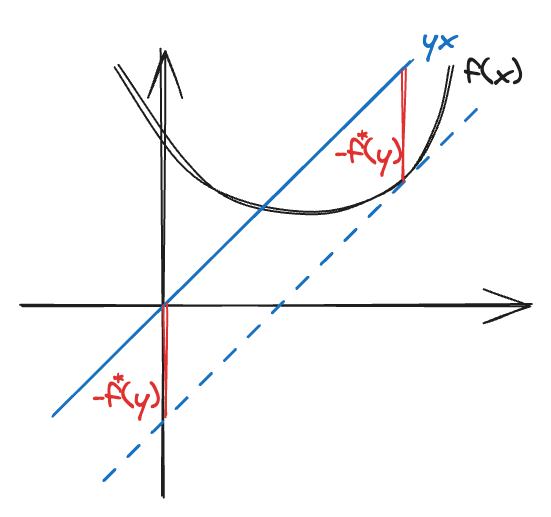
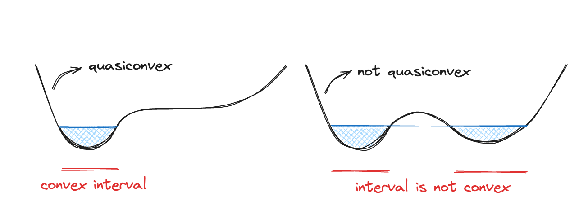

# :book: Convex functions

**Table of Contents**
- [:book: Convex functions](#book-convex-functions)
  - [Basic properties](#basic-properties)
    - [Extended-value extension](#extended-value-extension)
    - [First-order conditions](#first-order-conditions)
    - [Second-order conditions](#second-order-conditions)
    - [Sublevel sets](#sublevel-sets)
    - [Epigraph](#epigraph)
  - [Operations that preserve convexity](#operations-that-preserve-convexity)
    - [Composition](#composition)
    - [Minimization](#minimization)
    - [Perspective of a function](#perspective-of-a-function)
  - [Conjugate function](#conjugate-function)
  - [Quasiconvex functions](#quasiconvex-functions)
    - [Differentiable quasiconvex functions](#differentiable-quasiconvex-functions)
    - [Operations that preserve quasiconvexity](#operations-that-preserve-quasiconvexity)
  - [Log-convex functions](#log-convex-functions)
  - [Convexity with respect to generalized inequalities](#convexity-with-respect-to-generalized-inequalities)
    - [Monotonicity with respect to generalized inequality](#monotonicity-with-respect-to-generalized-inequality)
    - [Convexity with respect to a generalized inequality](#convexity-with-respect-to-a-generalized-inequality)

## Basic properties

A function $f:\mathbb{R}^n\to\mathbb{R}$ is convex if $\mathbf{dom}\ f$ is a convex set and if for all $x,y\in\mathbf{dom}\ f$, and $\theta$ with $0\leq\theta\leq1$, we have

$$
\begin{align*}
f(\theta x+(1-\theta)y)\leq\theta f(x)+(1-\theta)f(y).
\end{align*}\tag{3.1}
$$

> Any line segment between two points lies above the graph.

- $-f$ is concave *(we will only focus on convex properties in this note)*
- affine is both convex and concave, $f(\theta x+(1-\theta)y)=\theta f(x)+(1-\theta)f(y)$

We list some examples of convex function:

- $f(x)=a^\top x+b$
- $f(x)=\text{tr}(A^Tx)+b$
- $f(x)=\exp(x)$
- $f(x)=x\log(x)$
- $f(x) = 1/x,\ x>0$
- $f(x)=\\|x\\|\_p=(\sum_{i=1}^n|x_i|^p)^\frac{1}{p},\ p\geq1$

> For all $x\in\mathbf{dom}\ f,v\in\mathbb{R}^n,\ g(t)=f(x+tv)$ is convex if and only if $f(x)$ is convex.

### Extended-value extension
It is usually convenient to extend the feasible of a convex function to $\mathbb{R}^n$, we define an extended-value extension that is also convex so that we do not need to explicitly describe the domain.

$$
\tilde{f}:\mathbb{R}^n\to\mathbb{R}\cup\{\infty\}\ ;\ \ \ \tilde{f}(x)=
\begin{cases}
f(x)&x\in\mathbf{dom}\ f,\\ 
\infty&x\notin\mathbf{dom}\ f.
\end{cases}
$$

### First-order conditions
Suppose $f$ is differentiable, then $f$ is convex if and only if $\mathbf{dom}\ f$ is convex and for all $x,y\in\mathbf{dom}\ f$,

$$
\begin{align*}
f(y)\geq f(x)+\nabla f(x)^\top(y-x).
\end{align*}\tag{3.2}
$$

> We prove the 1-dimensional case, i.e., $f:\mathbb{R}\to\mathbb{R}$ is convex if and only if $f(y)\geq f(x)+f^\prime(x)(y-x)$.
> 
> We first show that $f$ is convex implies $f(y)\geq f(x)+f^\prime(x)(y-x)$. Assume that $f$ is convex, then for $t\in(0,1]$,
>
> $$
> \begin{align*}
> f\big((1-t)x+ty\big)\leq (1-t)f(x)+tf(y)&\implies tf(y)-tf(x)\geq f\big(x+t(y-x)\big)-f(x)\\
> &\implies f(y)-f(x)\geq\frac{f\big(x+t(y-x)\big)-f(x)}{t}
> \end{align*}
> $$
>
> Since the RHS goes smaller if $t\to1$, therefore we only care if the inequality holds when $t\to0$.
>
> $$
> \lim_{t\to0}\frac{f\big(x+t(y-x)\big)-f(x)}{t}=\lim_{t\to0}\frac{f\big(x+t(y-x)\big)-f(x)}{t(y-x)}(y-x)=f^\prime(x)(y-x)
> $$
>
> Thus we get $f(y)\geq f(x)+\nabla f(x)^\prime(y-x)$ when $t\to0$.
>
> We next show that $f(y)\geq f(x)+f^\prime(x)(y-x)$ implies $f$ is convex. By choosing $x\neq y$ and $\theta\in[0,1]$ such that $z=\theta x+(1-\theta)y$, we have
>
> $$
> f(x)\geq f(z)+f^\prime(z)(x-z)\ ;\ \ f(y)\geq f(z)+f^\prime(z)(y-z).
> $$
>
> Multiplying the first inequality by $\theta$ and the second inequality by $(1-\theta)$,
>
> $$
> \begin{align*}
> \theta f(x) + (1-\theta) f(y)&\geq \theta\big(f(z)+f^\prime(z)(x-z)\big)+(1-\theta)\big(f(z)+f^\prime(z)(y-z)\big)\\
> &=f(z)+ \theta f^\prime(z)x+(1-\theta)f^\prime(z)y-\theta f^\prime(z)z-(1-\theta)f^\prime(z)z\\
> &=f(z) + f^\prime(z)z - f^\prime(z)z =f(z)
> \end{align*}
> $$
>
> Thus $f$ is convex.

### Second-order conditions
Suppose $f$ is twice differentiable, i.e., Hessian $\nabla^2f$ exists, then $f$ is convex if and only if $\mathbf{dom}\ f$ is convex and for all $x\in\mathbf{dom}\ f$, its Hessian is positive semidefinite:

$$
\nabla^2f(x)\succeq0.
$$

We list some examples that are easy to verify convexity by second-order condition:

- quadratic function: $f(x)=\frac{1}{2}x^\top Px+q^\top x+r,\ \nabla f(x)=Px+q,\ \nabla^2f(x)=P$, thus $f$ is convex if and only if $P$ is positive semidefinite.
- least squares: $f(x)=\\|Ax-b\\|^2_2,\ \nabla f(x)=2\\|Ax-b\\|\frac{A^\top(Ax-b)}{\\|Ax-b\\|}=2A^\top(Ax-b),\ \nabla^2f(x)=2A^\top A$, thus least squares are always convex.

### Sublevel sets
The $t$-sublevel sets of a convex function $f:\mathbb{R}^n\to\mathbb{R}$ is defined as $S_t=\\{x\in\mathbf{dom}\ f\mid f(x)\leq t\\}$. Sublevel sets of a convex function are convex for any value $t$. 

> Sublevel sets can be used to verify quasiconvexity.

### Epigraph
The graph of a function $f:\mathbb{R}^n\to\mathbb{R}$ is defined as $\\{(x,f(x))\mid x\in\mathbf{dom}\ f\\}$, which is a subset of $\mathbb{R}^{n+1}$. The epigraph of a function $f:\mathbb{R}^n\to\mathbb{R}$ is defined as $\mathbf{epi}\ f=\\{(x,t)\mid x\in\mathbf{dom}\ f,\ f(x)\leq t\\}\subseteq\mathbb{R}^{n+1}$. A function is convex if and only if its epigraph is a convex set.

## Operations that preserve convexity

In order to establish a function $f$ is convex, one can directly use the definition of convex functions, or show that $f$ is obtained from simple convex functions by operations that preserve convexity. Here are some of the operations.

- $f$ is convex $\implies\alpha f(x),\ \alpha\geq0$  is convex
- $f_i$ are convex $\implies\sum f_i(x)$ is convex
- $f_i$ are convex, $w_i$ are nonnegative $\implies\sum w_i f_i(x)$ is convex
- $f$ is convex, $g$ is affine $\implies f(g(x))$ is convex
- $f_i$ are convex $\implies\max(f_1(x),\dots,f_n(x))$  is convex
- $f(x,y)$ is convex, $y\in\mathcal{A}\implies\sup_{y\in\mathcal{A}}f(x,y)$ is convex

### Composition
Suppose $g:\mathbb{R}^n\to\mathbb{R}^k,\ h:\mathbb{R}^k\to\mathbb{R}$, the compostion $f=h\circ g:\mathbb{R}^n\to\mathbb{R}$ is defined by

$$
f(x)=h(g(x))\ ;\ \ \mathbf{dom}\ f=\\{x\in\mathbf{dom}\ g\mid g(x)\in\mathbf{dom}\ h\\}.
$$

**scalar composition** ($k=1$)

$$
\begin{align*}
f^{\prime\prime}(x)=h^{\prime\prime}(g(x))\underbrace{[g^\prime(x)]^2}_{\geq0}+g^{\prime\prime}(x)h^\prime(g(x)).
\end{align*}\tag{3.9}
$$

> In order to make $f$ convex, we need $f^{\prime\prime}\geq0$ (second-order conditions). By $(3.9)$, we need $h^{\prime\prime}\geq0$ and both $h^\prime,g^{\prime\prime}\geq0$ or $\leq0$.

- $f$ is convex if $h$ is convex ($h^{\prime\prime}\geq0$) and nondecreasing, and $g$ is convex ($g^{\prime\prime},h^\prime\geq0$)
- $f$ is convex if $h$ is convex ($h^{\prime\prime}\geq0$) and nonincreasing, and $g$ is concave ($g^{\prime\prime},h^\prime\leq0$)

**vector composition** ($k\geq1$)

$$
\begin{align*}
f^{\prime\prime}(x)=g^\prime(x)^\top\nabla^2h(g(x))g^\prime(x)+\nabla h(g(x))^\top g^{\prime\prime}(x).
\end{align*}\tag{3.15}
$$

- $f$ is convex if $h$ is convex, $h$ is nondecreasing in each argument, and $g_i$ are convex
- $f$ is convex if $h$ is convex, $h$ is nonincreasing in each argument, and $g_i$ are concave

###  Minimization
We have seen that maximum or supremum of convex functions is convex. We now consider a special form of minimization

$$
\begin{align*}
g(x)=\inf_{y\in C}f(x,y)
\end{align*}\tag{3.16}
$$

is convex if $g(x)>-\infty$ for all $x$.

For example, given a convex function $f(x,y)=x^\top Ax+2x^\top By+y^\top Cy$ with 

$$\begin{pmatrix}A&B\\\\B^\top &C\end{pmatrix}\succeq0\ ;\ \ C\succeq0.$$ 

By setting the derivative of $f(x,y)$ with respective to $y$ to 0, we get $y=C^{-1}B^\top x$, the minimization

$$
\begin{align*}
g(x)=\inf_{y}f(x,y)&=x^\top Ax+2x^\top B(C^{-1}B^\top x)+(C^{-1}B^\top x)^\top C(C^{-1}B^\top x)\\
&=x^\top Ax-2x^\top BC^{-1}B^\top x+x^\top BC^{-1}B^\top x\\
&=x^\top(A-BC^{-1}B^\top)x
\end{align*}
$$

By Schur complement,

$$
C\succeq0,\ \begin{pmatrix}A&B\\\\B^\top&C\end{pmatrix}\succeq0 \implies A-BC^{-1}B^\top\succeq0,
$$ 

therefore $g$ is convex.

### Perspective of a function
If $f:\mathbb{R}^n\to\mathbb{R}$, then the perspective of $f$ is the function $g:\mathbb{R}^{n+1}\to\mathbb{R}$ defined by

$$
g(x,t)=tf(x/t)\ ;\ \ \mathbf{dom}\ g=\\{(x,t)\mid x/t\in\mathbf{dom} f,\ t>0\\}.
$$

If $f$ is convex, then $g$ is convex. We give a short proof using epigraph and the perspective function of $\mathbb{R}^{n+1}$. For $t>0$, we have

$$
\begin{align*}
(x,t,s)\in\mathbf{epi}\ g&\iff tf(x/t)\leq s\\
&\iff f(x/t)\leq s/t\\ 
&\iff(x/t, s/t)\in\mathbf{epi}\ f
\end{align*}
$$

Since $f$ is convex $\iff\mathbf{epi}\ f$ is convex, we have $g$ is convex $\iff\mathbf{epi}\ g$ is convex.

## Conjugate function
Let $f:\mathbb{R}^n\to\mathbb{R}$, then $f^*:\mathbb{R}^n\to\mathbb{R}$ is the conjugate of $f$ defined by

$$
\begin{align*}
f^\*(y)=\sup_{x\in\mathbf{dom}\ f}\big(y^\top x-f(x)\big).
\end{align*}\tag{3.18}
$$

We immediately see that $f^*$ is convex since it is the supremum of affine function of $y$, whether $f$ is convex or not. For example given an affine function $f(x)=ax+b$,

$$
f^\*(y)=\sup_{x\in\mathbb{R}}\big(yx-(ax+b)\big)=\sup_{x\in\mathbb{R}}\big((y-a)x-b\big)=\begin{cases}-b&\text{if }y=a,\\\\ \infty&\text{if }y\neq a.\end{cases}
$$

For 1-dimensional case, conjugate function tries to find the maximum distance between $yx$ and $f(x)$. A nice demonstration can be found here: [Fenchel conjugate function demo](https://youtu.be/zkesU2jMkCg).

    
    
<b>Fig. 1 </b>Conjugate function.

**Fenchel’s inequality** By $(3.18)$, we obtain the Fenchel's inequality

$$
f(x)+f^*(y)\geq y^\top x.
$$

**Conjugate of the conjugate** If $f$ is convex and closed, i.e., $\mathbf{epi}\ f$ is a closed convex set, then $f^{**}=f$, i.e., the conjugate of conjugate of $f$ is $f$ itself.

**Differetiable functions** If $f$ is differentiable, then the conjugate of $f$ is also called the Legendre transform of $f$. Suppose $f$ is convex and differetiable, the maximizer $x^\*$ must satisfy the first-order condition. Take the derivatives if $y^\top x^\*-f(x^\*)$ to zero, we get $y=\nabla f(x^*)$. Therefore, if $y=\nabla f(x)$, we have a closed-form to compute the conjugate function

$$
f^*(y)=\nabla f(x)^\top x-f(x).
$$

## Quasiconvex functions

A function $f:\mathbb{R}^n\to\mathbb{R}$ is called quasiconvex if all its sublevel sets are convex.

    
    
<b>Fig. 2 </b>Quasiconvexity.

We could also characterize quasiconvexity like the definition of convex function: A function $f$ is quasiconvex if $\mathbf{dom}\ f$ is convex and if for all $x,y\in\mathbf{dom}\ f$, and $\theta$ with $0\leq\theta\leq1$, we have

$$
\begin{align*}
f(\theta x+(1-\theta)y)\leq\max\\{f(x),f(y)\\}.
\end{align*}\tag{3.19}
$$

> Points between the line segmant cannot be larger than the $\max\\{f(x),f(y)\\}$-level.

### Differentiable quasiconvex functions
**First-order conditions** Suppose $f:\mathbb{R}^n\to\mathbb{R}$ is differentiable, then $f$ is quasiconvex if and only if $\mathbf{dom}\ f$ is convex and for all $x,y\in\mathbf{dom}\ f$,

$$
\begin{align*}
f(y)\leq f(x)\implies\nabla f(x)^\top(y-x)\leq0.
\end{align*}\tag{3.20}
$$

**Second-order conditions** Suppose $f:\mathbb{R}^n\to\mathbb{R}$ is twice differentiable. If $f$ is quasiconvex, then if $\mathbf{dom}\ f$ is convex and all $y\in\mathbb{R}^n$, we have

$$
\begin{align*}
y^\top\nabla f(x)=0\implies y^\top\nabla^2f(x)y\geq0.
\end{align*}\tag{3.21}
$$

### Operations that preserve quasiconvexity

- $f_i$ are quasiconvex $\implies\max(f_1(x),\dots f_k(x))$ is quasiconvex
- $f_i$ are quasiconvex,  $w_i$ are nonnegative $\implies\max(w_1f_1(x),\dots w_kf_k(x))$ is quasiconvex
- $g:\mathbb{R}^n\to\mathbb{R}$ is quasiconvex, $h:\mathbb{R}\to\mathbb{R}$ is nondecreasing $\implies f=h\circ g$ is quasiconvex
- $f$ is quasiconvex, $y\in C\implies g(x)=\inf_{y\in C}f(x,y)$ is quasiconvex
- sum of quasiconvex functions is not necessary quasiconvex

## Log-convex functions

A function $f:\mathbb{R}^n\to\mathbb{R}$ is log-convex if $f(x)>0$ for all $x\in\mathbf{dom}\ f$ and $\log\ f$ is convex. We also write log-convexity like the definition of convex function: a function $f:\mathbb{R}^n\to\mathbb{R}$ with convex domain and $f(x)>0$ for all $x\in\mathbf{dom}\ f$ is log-convex if and only if for all $x,y\in\mathbf{dom}\ f$ and $0\leq\theta\leq1$,

$$
f(\theta x+(1-\theta)y)\leq f(x)^\theta f(y)^{(1-\theta)}.
$$

> $$\log f(\theta x+(1-\theta)y)\leq\theta\log f(x)+(1-\theta)\log f(y).$$

**Second-order conditions** $f$ is log-convex if and only if for all $x\in\mathbf{dom}\ f$,

$$
f(x)\nabla^2f(x)\succeq\nabla f(x)\nabla f(x)^\top.
$$

## Convexity with respect to generalized inequalities

Suppose that $K\subseteq\mathbb{R}^n$ is a proper cone with associated generalized inequality $\succeq_K$.

### Monotonicity with respect to generalized inequality

- $f:\mathbb{R}^n\to\mathbb{R}$ is $K$-nondecreasing if $x\preceq_Ky\implies f(x)\leq f(y)$
- $f:\mathbb{R}^n\to\mathbb{R}$ is $K$-nonincreasing if $x\succeq_Ky\implies f(x)\geq f(y)$
- $f:\mathbb{R}^n\to\mathbb{R}$ is $K$-increasing if $x\preceq_Ky,x\neq y\implies f(x)<f(y)$
- $f:\mathbb{R}^n\to\mathbb{R}$ is $K$-decreasing if $x\succeq_Ky,x\neq y\implies f(x)>f(y)$

**Gradient conditions for monotoncity** Recall that a differentialbe function $f:\mathbb{R}\to\mathbb{R}$ with convex domain is nondecreasing if and only if $f^\prime(x)\geq0$ for all $x\in\mathbf{dom}\ f$. This can also be extended to generalized inequalities:

- $\nabla f(x)\succeq_{K^*}0\iff f$ is $K$-nondecreasing
- $\nabla f(x)\preceq_{K^*}0\iff f$ is $K$-nonincreasing
- $\nabla f(x)\succ_{K^*}0\implies f$ is $K$-increasing
- $\nabla f(x)\prec_{K^*}0\implies f$ is $K$-decreasing

### Convexity with respect to a generalized inequality
A function $f:\mathbb{R}^n\to\mathbb{R}^m$ is $K$-convex if for all $x,y\in\mathbf{dom}\ f$ and $0\leq\theta\leq1$,

$$
f(\theta x+(1-\theta)y)\preceq_K\theta f(x)+(1-\theta)f(y).
$$

**First-order conditions** A differentiable function $f$ is $K$-convex if and only if its domain is convex and for $x,y\in\mathbf{dom}\ f$,

$$
f(y)\succeq_Kf(x)+Df(x)(y-x).
$$

> These definitions reduce to ordinary convexity when $m=1$ and $K=\mathbb{R}_+$.

