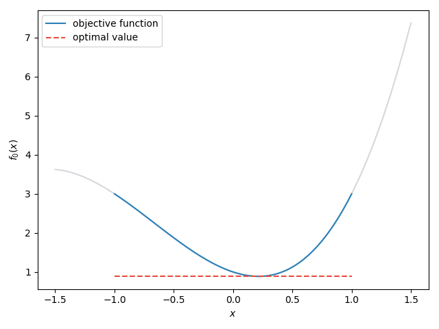
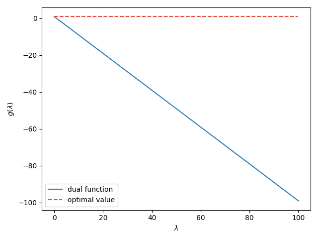

# :book: Duality

**Table of Contents**
- [:book: Duality](#book-duality)
  - [Lagrange dual function](#lagrange-dual-function)
    - [Lower bounds on optimal value](#lower-bounds-on-optimal-value)
    - [Conjugate functions](#conjugate-functions)
  - [Lagrange dual problem](#lagrange-dual-problem)

## Lagrange dual function

Consider an optimization problem:

$$
\begin{align*}
\min_x\ &f_0(x)\\
\text{s.t.}\ &f_i(x)\leq0,\ i=1,\dots,m \\
&h_i(x)=0,\ i=1,\dots,p,
\end{align*}\tag{5.1}
$$

with domain $\mathcal{D}=\bigcap_{i=0}^m\mathbf{dom}\ f_i\ \cap\ \bigcap_{i=1}^p\mathbf{dom}\ h_i$ is nonempty, and denote the optimal value by $p^*$. Note the Problem $(5.1)$ is **not necessarily convex**. The idea of Lagrangian duality is to leverage the constraints in Problem $(5.1)$ into the objective function with some weights. We define the Lagrangian $\mathcal{L}:\mathbb{R}^n\times\mathbb{R}^m\times\mathbb{R}^n\to\mathbb{R}$ by

$$
\mathcal{L}(x,\lambda,\nu)=f_0(x)+\sum_{i=1}^m\lambda_if_i(x)+\sum_{i=1}^p\lambda_ih_i(x),
$$

where $\lambda$ and $\nu$ are called the Lagrange multipliers or dual variables.

**Dual function**

We define the (Lagrange) dual function $g:\mathbb{R}^n\times\mathbb{R}^m\times\mathbb{R}^n\to\mathbb{R}$ by

$$
g(\lambda,\nu)=\inf_{x\in\mathcal{D}}\mathcal{L}(x,\lambda,\nu)=\inf_{x\in\mathcal{D}}\left(f_0(x)+\sum_{i=1}^m\lambda_if_i(x)+\sum_{i=1}^p\lambda_ih_i(x)\right).
$$

> The dual function is the pointwise infimum of a family of affine functions of $(\lambda,\nu)$, it is always concave even if Problem $(5.1)$ is not convex.

### Lower bounds on optimal value

Suppose $x^*$ is the optimal solution, for any $\lambda\geq0$ and any $\nu$,

$$
\mathcal{L}(x^*,\lambda,\nu)=f_0(x^*)+\underbrace{\sum_{i=1}^m\lambda_if_i(x^*)}_{\leq0}+\underbrace{\sum_{i=1}^p\lambda_ih_i(x^*)}_{=0}\leq f_0(x^*).
$$

We have the relationship

$$
\begin{align*}
g(\lambda,\nu)=\inf_{x\in\mathcal{D}}\mathcal{L}(x,\lambda,\nu)\leq \inf_{x\in\mathcal{D}}\mathcal{L}(x^*,\lambda,\nu)\leq f_0(x^*)\leq p^*.
\end{align*}\tag{5.2}
$$

**Example** Consider the problem

$$
\begin{align*}
\min_{x}\ &x^3+2x^2-x+1\\\text{s.t.}\  &x^2\leq1\iff 0\leq x\leq 1 
\end{align*}
$$

The original problem is lower bounded by the optimal value.

   
   
<b>Fig. 1 </b>Lower bound of objective function.

Now consider the dual function

$$
g(\lambda)=\inf_x\left(x^3+2x^2-x+1+\lambda (x^2-1)\right).
$$

The dual function is upper bounded by the optimal value.

   
   
<b>Fig. 2 </b>Upper bound of dual function.

By the example, we have that the optimal value

- is the lower bound of the objective function
- is the upper bound of the dual function

and thus the dual function is always less or equal to the objective function.

### Conjugate functions

Recall the conjugate function

$$
f^*(y)=\sup_x\big(y^\top x-f(x)\big).
$$

The conjugate function is closely related to the dual function. Consider the optimization problem

$$
\begin{align*}
\min_x\ &f_0(x)\\
\text{s.t.}\ &Ax\preceq b \\
&Cx=d
\end{align*}\tag{5.10}
$$

Using the conjugate of $f_0$, we can rewrite the the dual function of Problem $(5.10)$ as

$$
\begin{align*}
g(\lambda,\nu)&=\inf_x\left(f_0(x)+\lambda^\top(Ax-b)+\nu^\top(Cx-d)\right)\\
&=-b^\top\lambda-d^\top\nu+\inf_x(f_0(x)+(A^\top\lambda+C^\top\nu)^\top x)\\
&=-b^\top\lambda-d^\top\nu-f_0^*(-A^\top\lambda-C^\top\nu).
\end{align*}\tag{5.11}
$$

Thus we can express the domain of the dual function by the conjugate of objective,

$$
\mathbf{dom}\ g=\{(\lambda,\nu)\mid-A^\top\lambda-C^\top\nu\in\mathbf{dom}\ f_0^*\}.
$$

## Lagrange dual problem

We know that the optimal value is an upper bound of the dual function. This leads to the (Lagrange) dual problem

$$
\begin{align*}
\max_{\lambda,\nu}\ &g(\lambda,\nu)\\
\text{s.t.}\ &\lambda\succeq0.
\end{align*}\tag{5.16}
$$